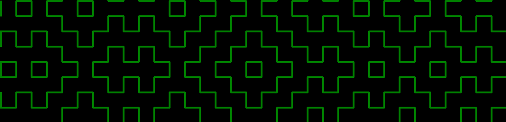
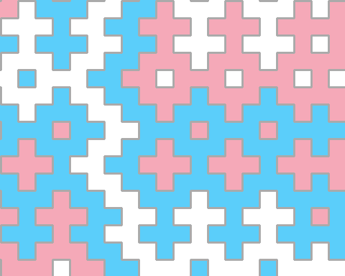
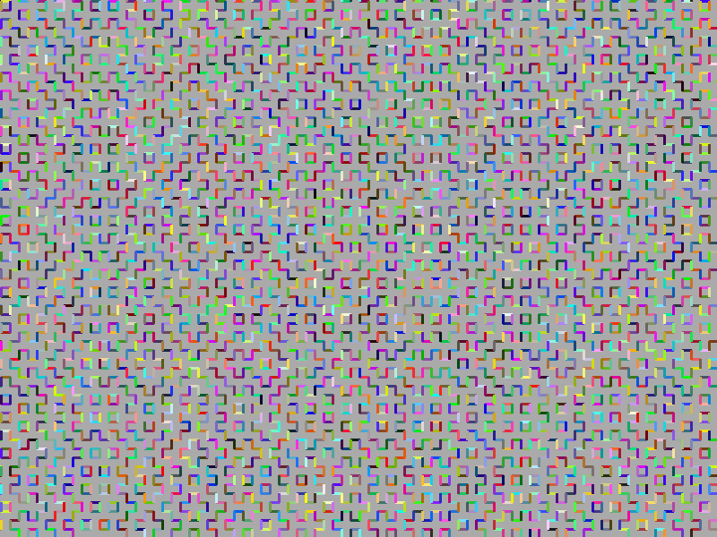
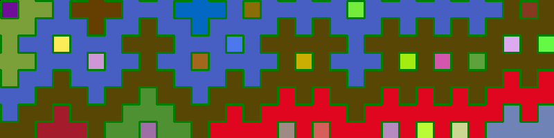
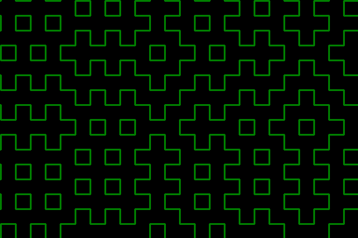

# Hitomezashi Generator



This is a hitomezashi pattern generator written in Python. It uses the Pillow Image Processing libary to generate images containing hitomezashi patterns. The generation is confirgurable and features configuration options like providing fill colors, changeing the size of the image output or providing a randomness seed for consistent outputs.

## Prerequesits

- [Python 3.8 or newer](https://www.python.org/)
- [Pillow](https://pypi.org/project/pillow/)

## Usage

``` 
usage: python3 generator.py [-h] [-seed SEED] [-width WIDTH] [-height HEIGHT] [-stitch STITCH] [-fill [FILL ...]]
                            [-color COLOR] [--rainbow] [--rainbowfill] [-output OUTPUT] [--noshow] [--license]

options:
  -h, --help            show this help message and exit
  -seed SEED, -s SEED   set a generation seed (default: random Int32)
  -width WIDTH          set the width in px of generated pattern (default: 400px)
  -height HEIGHT        set the height in px of generated pattern (default: 300px)
  -stitch STITCH        set the length in px of stitches (default: 25px)
  -fill [FILL ...], -f [FILL ...]
                        set an arbitrary amount of hex color codes to infill the pattern (default: DISABLED)
  -color COLOR, -c COLOR
                        set a hex color code for the line color (default: #FFFFFF)
  --rainbow, --r        enable random line colors for each drawn line (default: DISABLED). Overwrites color
                        argument
  --rainbowfill         enable random fill colors for each area (default: DISABLED). Overwrites fill argument.
  -output OUTPUT, -o OUTPUT
                        set a save location and name (default: [current_directory]/hitomezashi.png).
  --noshow              doesn't show the image after generation
  --license             displays the applicable license of this software (GNU GPLv3)
```

### Examples

The following are some examples of generated patterns with respective the command provided below:



`python3 generator.py -f 5BCEFA F5A9B8 FFFFFF -c AAAAAA -width 500 -height 400 -s 1234`



`python3 generator.py --r -f "#AAAAAA" -stitch 10 -width 800 -height 600 -s 7`



`python3 generator.py --rainbowfill -width 800 -height 200 -s 9876`



`python3 generator.py -s 9999`
